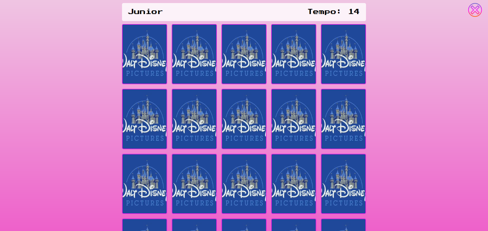

# Jogo da Memória

> Aprendizados

Projeto construído com conceitos de link de paginas, local storages do navegador, arrays, efeitos transform (CSS), disable nos botões e reset no jogo.

[Clique aqui para acessar](https://djh0w.github.io/memory-game/index.html)

## Tecnologias

- HTML
- CSS
- JavaScript

## Contato

joao.ps.junior1989@gmail.com

